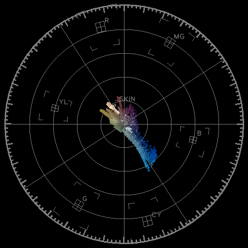

# vector_scope

Python implementation of NTSC vector scope.

## Description

Import a image file to draw NTSC vector scope.

## Requirements

- Python3
- Numpy
- cv2 (import with `python3 -m pip install opencv-python`)
- scikit-image (import with `python -m pip install scikit-image`)

## Usage

`python3 vector_scope.py [--precise] [image file name]`

For efficiency reasons, vector_scope.py would resize large image (either width or hight is longer than 1024px) down to an image whose longest dimension is no more than 1024px. `--precise` or `-p` flag would prevent vector_scope.py to do so and send the original image into processing workflow.

After finishing calculation and drawing, the vector scope image should pop out automatically. If not, look for the result.png file in the same folder where vector_scope.py locates, or see if the image lies in the root folder of python runtime.

## Author

[delphinus1024](https://github.com/delphinus1024)

## License

[MIT](https://raw.githubusercontent.com/delphinus1024/vector_scope/master/LICENSE.txt)

